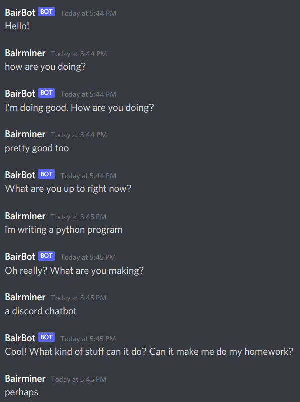

# GPT3 Discord Chatbot
GPT3/OpenAI API chatbot for Discord. Requires an OpenAI API key.

## chatbot.py
This program handles interfacing with the OpenAI API. Based on a prexisting prompt (can be edited by changing the header argument of the Bot class), GPT3 will attempt to complete the conversation and respond to the user's input. Previous conversation lines are then added to the prompt, in order to give GPT3 context to generate further replies. This feature can be disabled, however it may result in less predicatable replies. This program can be run standalone in the terminal. Also implemented is the ability to save conversations as PKL files, which can then be loaded to continue the conversation.

## discord.py
This program implements the Bot class from chatbot.py as a Discord bot. By mentioning the bot on a Discord server or in a DM, GPT3 will attempt to generate a reply to the message. 

## Setup 
1. Install the openai and discord Python libraries
2. Enter your OpenAI API key in key.py
3. (skip this step if you are not using the Discord feature) Enter your Discord bot token in config.py, along with the bot's Discord status and initial prompt (can be a simple description of a person and their personality)
4. Run discord.py or chatbot.py, depending on which you want to use
